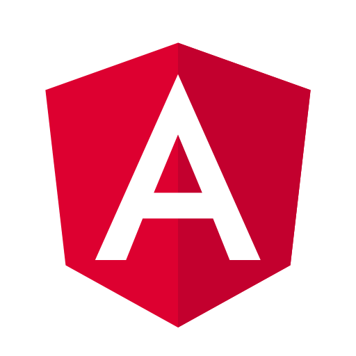

Hi, I’m Mohit 👋 

- I’m a software engineer who builds and learns about web apps and backend systems. I work mainly with React, Angular, and TypeScript on the frontend, and Node.js with Express on the backend.

- Beyond development, I bring an understanding of cloud infrastructure, having worked hands-on with AWS services (including IAM, EC2, VPC, S3, and Lambda) and Docker.

Currently exploring advanced React patterns, GraphQL, and AI tools for developers. 
Always open to learning, collaborating, or discussing ideas around software architecture.

Let’s connect and build something impactful! 🚀

 

  
  
  
  
  
  
  
  
  
  
  
  
  
  
  
  
  
  
  
  
  
  
  

